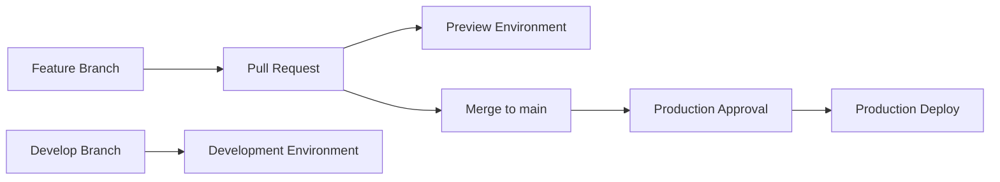

# Quick Setup Guide for GitHub Environments

## 🚀 5-Minute Setup

### Step 1: Create Environments
1. Go to **Settings** → **Environments** in GitHub repo
2. Click **New environment**
3. Create these environments:

```
✅ development (no protection rules)
✅ production (with protection rules)
```

### Step 2: Configure Production Protection
For `production` environment:
- ✅ **Required reviewers**: Add team members who can approve production deploys
- ✅ **Wait timer**: 5 minutes (optional)
- ✅ **Deployment branches**: Restrict to `main` branch only

### Step 3: Add Secrets to Each Environment
For **each environment**, add this secret:
- **Name**: `AZURE_STATIC_WEB_APPS_API_TOKEN`
- **Value**: Get from Azure Portal → Static Web App → **Manage deployment token**

⚠️ **Important**: Add secrets to **Environment secrets**, not repository secrets!

### Step 4: Test Deployment
1. Create a feature branch
2. Make changes to `webapp/` folder
3. Open Pull Request → Should create Preview environment
4. Merge to `main` → Should trigger Production deployment (with approval)

## 🔒 Security Benefits

| Feature | Repository Secrets | Environment Secrets |
|---------|-------------------|-------------------|
| Access Control | ❌ All workflows | ✅ Per environment |
| Approval Gates | ❌ No | ✅ Yes |
| Branch Restrictions | ❌ No | ✅ Yes |
| Audit Trail | ✅ Basic | ✅ Detailed |
| Secret Rotation | ❌ Global impact | ✅ Per environment |

## 🎯 Deployment Flow



## 📋 Checklist

- [ ] Development environment created
- [ ] Production environment created with protection rules
- [ ] Secrets added to both environments
- [ ] Team members added as required reviewers
- [ ] Test deployment completed
- [ ] Documentation updated

## ❓ Need Help?

- **Missing secrets**: Check Azure Portal for deployment tokens
- **Approval not working**: Verify protection rules are enabled  
- **Deploy failing**: Check Actions tab for detailed logs
- **Access issues**: Contact repository admins
