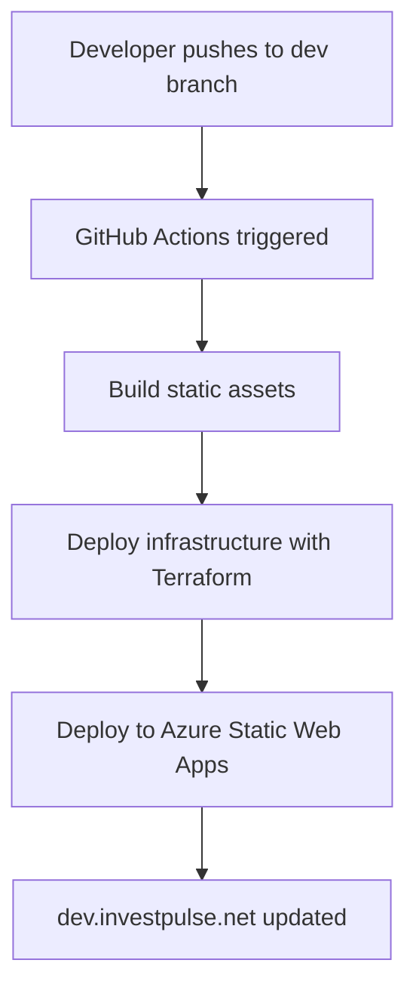

# Dev Environment Deployment

This document describes the automatic deployment setup for the development environment at `dev.investpulse.net`.

## Overview

The dev environment provides a single, continuously updated development environment that reflects the current state of the `dev` branch. This simplifies testing and reduces infrastructure costs compared to having multiple preview environments.

## Workflow

### Automatic Deployment

1. **Trigger**: Push to `dev` branch
2. **GitHub Actions**: `.github/workflows/deploy-dev.yml`
3. **Result**: Updates `dev.investpulse.net` automatically

### Manual Deployment

You can also deploy manually using the helper scripts:

```bash
# Build static assets
./scripts/build_and_push.sh dev

# Deploy infrastructure
./scripts/deploy.sh dev
```

## Infrastructure

The dev environment creates:
- **Resource Group**: `dev-investpulse-rg`
- **Static Web App**: `dev-investpulse-webapp`
- **Custom Domain**: `dev.investpulse.net`
- **GitHub Environment**: `dev`

## Configuration

### Required Secrets

Add these secrets to the `dev` GitHub Environment:
- `AZURE_STATIC_WEB_APPS_API_TOKEN`: From Azure Portal > Static Web App > Manage deployment token
- `CLOUDFLARE_API_TOKEN`: For DNS management (optional)
- `AZURE_CLIENT_ID`, `AZURE_CLIENT_SECRET`, `AZURE_SUBSCRIPTION_ID`, `AZURE_TENANT_ID`: For Terraform deployment

### Environment Variables

The workflow uses:
- `envName = "dev"`
- `NODE_ENV = "development"`

## Benefits

- **Simplified Workflow**: Single dev environment, no per-PR environments
- **Cost Optimization**: One environment instead of multiple preview environments
- **Immediate Feedback**: Changes are visible immediately after push to `dev` branch
- **Consistent State**: Environment always reflects the `dev` branch state

## Comparison with Other Environments

| Environment | Branch | Domain | Deployment | Purpose |
|-------------|--------|--------|------------|---------|
| `dev` | `dev` | `dev.investpulse.net` | Automatic | Development testing |
| `development` | `develop` | `development.investpulse.net` | Manual/Triggered | Alternative dev environment |
| `production` | `main` | `investpulse.net` | Manual approval | Production |

## Troubleshooting

### Deployment Fails

1. Check GitHub Actions logs in the repository
2. Verify all required secrets are set in the `dev` environment
3. Ensure the `dev` branch exists and has the latest changes

### Domain Not Accessible

1. Verify DNS propagation (can take up to 24 hours)
2. Check Cloudflare DNS settings
3. Verify Azure Static Web App is running

### Build Fails

1. Check the build logs in GitHub Actions
2. Test locally with `./scripts/build_and_push.sh dev`
3. Ensure all dependencies are properly specified in `package.json`

## Expected Workflow



## Cost Estimate

- **Azure Static Web App (Free Tier)**: $0/month
- **Resource Group**: $0/month  
- **Cloudflare DNS**: $0/month
- **Total**: **$0/month**