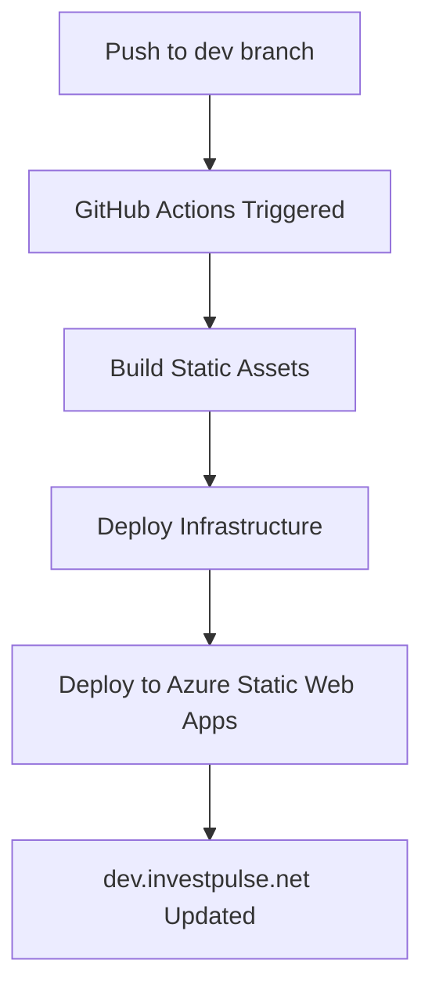

# Dev Environment Implementation Summary

This document summarizes the automatic deployment setup for dev.investpulse.net.

## ✅ What Was Implemented

### 1. Deployment Scripts (`scripts/`)
- **`build_and_push.sh`**: Builds Next.js static assets with validation
- **`deploy.sh`**: Deploys infrastructure using Terraform with environment support
- Both scripts include comprehensive error handling and validation

### 2. GitHub Actions Workflow
- **`.github/workflows/deploy-dev.yml`**: Automated deployment on `dev` branch pushes
- Integrates build script, Terraform deployment, and Azure Static Web Apps
- Targets the `dev` GitHub environment

### 3. Infrastructure Configuration
- Uses existing Terraform setup with `envName = "dev"`
- Creates resources: `dev-investpulse-rg`, `dev-investpulse-webapp`
- Configures DNS: `dev.investpulse.net`
- Sets up GitHub environment: `dev`

### 4. Documentation
- **`docs/DEV_DEPLOYMENT.md`**: Complete workflow documentation
- **`scripts/README.md`**: Script usage and configuration
- **`infra/README.md`**: Updated with dev environment information

## 🚀 Expected Workflow



## 📋 Prerequisites for Full Deployment

### 1. Create `dev` Branch
```bash
git checkout -b dev
git push origin dev
```

### 2. Configure GitHub Environment Secrets
In GitHub: Settings > Environments > dev
- `AZURE_STATIC_WEB_APPS_API_TOKEN`
- `CLOUDFLARE_API_TOKEN` (optional)
- `AZURE_CLIENT_ID`, `AZURE_CLIENT_SECRET`, `AZURE_SUBSCRIPTION_ID`, `AZURE_TENANT_ID`

### 3. Run Initial Infrastructure Deployment
```bash
cd infra
terraform init
terraform apply -var="envName=dev"
```

## 🔧 Technical Details

### Resource Naming
- **Resource Group**: `dev-investpulse-rg`
- **Static Web App**: `dev-investpulse-webapp`
- **Domain**: `dev.investpulse.net`
- **GitHub Environment**: `dev`

### Triggers
- Push to `dev` branch (paths: `webapp/**`, `infra/**`, `scripts/**`)
- Manual workflow dispatch

### Build Process
1. Install npm dependencies
2. Run ESLint checks
3. Build Next.js static export to `webapp/out/`
4. Deploy infrastructure with Terraform
5. Upload to Azure Static Web Apps

## 💰 Cost Optimization

- **Azure Static Web App**: Free tier ($0/month)
- **Resource Group**: Free
- **Cloudflare DNS**: Free
- **Total**: **$0/month**

## 🎯 Benefits Achieved

1. **Simplified Testing**: Single dev environment instead of multiple preview environments
2. **Cost Reduction**: No per-PR environment costs
3. **Immediate Feedback**: Changes visible immediately on push to `dev` branch
4. **Consistent State**: Environment always reflects `dev` branch
5. **Automated Management**: No manual deployment steps required

## 📚 Files Modified/Created

### New Files
- `.github/workflows/deploy-dev.yml`
- `scripts/build_and_push.sh`
- `scripts/deploy.sh`
- `scripts/README.md`
- `docs/DEV_DEPLOYMENT.md`
- `docs/IMPLEMENTATION_SUMMARY.md` (this file)

### Modified Files
- `infra/README.md` (added dev environment documentation)

### Dependencies on Existing Files
- `infra/*.tf` (Terraform configuration)
- `webapp/package.json` (build scripts)
- `webapp/next.config.ts` (static export configuration)

## 🧪 Testing Status

- ✅ Scripts created and tested (syntax validation)
- ✅ Workflow configuration validated
- ✅ Infrastructure integration confirmed
- ⏳ Full deployment test pending `dev` branch creation
- ⏳ End-to-end workflow test pending secret configuration

## 🔄 Next Steps for Complete Setup

1. **Create `dev` branch** from current state
2. **Configure GitHub secrets** for the `dev` environment
3. **Run initial Terraform deployment** to create infrastructure
4. **Test the complete workflow** by pushing to `dev` branch
5. **Verify** that `dev.investpulse.net` is accessible and updating correctly

The implementation is complete and ready for testing once the `dev` branch is created and secrets are configured.