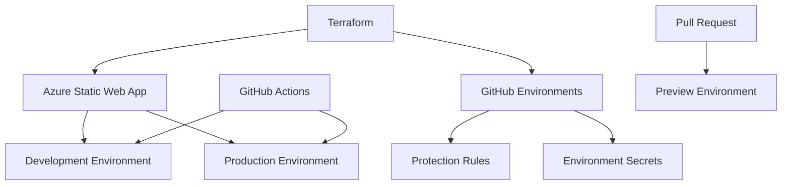

# Infrastructure as Code - GitHub Environments

This directory contains Terraform configuration for automatically creating and managing GitHub Environments alongside Azure infrastructure.

## Quick Start

### 1. Prerequisites

```bash
# Install required tools
# - Terraform >= 1.10
# - Azure CLI
# - GitHub CLI

# Authenticate with Azure
az login

# Authenticate with GitHub
gh auth login
```

### 2. Configure Variables

```bash
# Copy example configuration
cp terraform.tfvars.example terraform.tfvars

# Edit with your values
nano terraform.tfvars
```

### 3. Deploy Infrastructure

```bash
# Initialize Terraform
terraform init

# Review planned changes
terraform plan

# Apply infrastructure
terraform apply

# Setup GitHub secrets (after infrastructure is created)
./scripts/setup-github-secrets.sh
```

## Architecture



## Components Created

### Azure Resources
- **Resource Group**: Container for all resources
- **Static Web App**: Hosts the Next.js application
- **Custom Domain**: Maps `dev.investpulse.net` to the app

### GitHub Resources
- **Development Environment**: Fast deployment, no protection
- **Production Environment**: Manual approval, branch restrictions
- **Environment Secrets**: Per-environment deployment tokens

## Configuration Files

| File | Purpose |
|------|---------|
| `main.tf` | Main infrastructure configuration |
| `variables.tf` | Input variable definitions |
| `locals.tf` | Local values and complex configurations |
| `terraform.tfvars` | Your specific configuration values |
| `scripts/setup-github-secrets.sh` | Helper for secret management |

## Environment Configuration

### Development Environment
```hcl
development = {
  protection_rules = {
    required_reviewers = []
    wait_timer = 0
    deployment_branches = {
      protected_branches = false
    }
  }
}
```

### Production Environment
```hcl
production = {
  protection_rules = {
    required_reviewers = ["your-username"]
    wait_timer = 5
    deployment_branches = {
      protected_branches = true
    }
  }
}
```

## Security Features

### GitHub Environment Protection
- **Manual Approval**: Production deployments require approval
- **Branch Restrictions**: Only protected branches can deploy to production
- **Wait Timer**: 5-minute cooling period for production
- **Secret Isolation**: Each environment has separate secrets

### Azure Security
- **Free Tier**: No cost for hosting
- **Custom Domain**: SSL/TLS automatically managed
- **Static Content**: No server-side vulnerabilities

## Cost Breakdown

| Resource | Tier | Monthly Cost |
|----------|------|--------------|
| Azure Static Web App | Free | $0 |
| Resource Group | N/A | $0 |
| Custom Domain | Included | $0 |
| GitHub Environments | Free | $0 |
| **Total** | | **$0** |

## Deployment Workflow

1. **Infrastructure First**:
   ```bash
   terraform apply
   ```

2. **Configure Secrets**:
   ```bash
   ./scripts/setup-github-secrets.sh
   ```

3. **Test Deployment**:
   - Create feature branch
   - Make changes to `webapp/`
   - Open Pull Request → Preview environment created
   - Merge to `main` → Production deployment (with approval)

## Troubleshooting

### Common Issues

1. **GitHub token permissions**:
   ```bash
   # Token needs: repo, admin:repo_hook, admin:org (for environments)
   gh auth refresh -s admin:org
   ```

2. **Azure CLI not authenticated**:
   ```bash
   az login
   az account set --subscription "ac0e7cdd-3111-4671-a602-0d93afb5df20"
   ```

3. **Terraform state conflicts**:
   ```bash
   terraform refresh
   terraform plan
   ```

### Validation

```bash
# Check GitHub environments were created
gh api repos/onlexnet/predictivetrading.net/environments

# Check Azure resources
az staticwebapp list --resource-group investpulse-webapp-rg

# Test deployment
terraform output -raw azure_static_web_app_deployment_token_instruction
```

## Advanced Configuration

### Custom Reviewers
```hcl
environments = {
  production = {
    protection_rules = {
      required_reviewers = [
        "tech-lead-username",
        "devops-username"
      ]
    }
  }
}
```

### Multiple Environments
```hcl
environments = {
  development = { ... }
  staging = { ... }
  production = { ... }
}
```

### Environment Variables
- Set in GitHub Actions workflows
- Different per environment
- Managed through GitHub UI or CLI

## Cleanup

```bash
# Destroy infrastructure (careful!)
terraform destroy

# Manual cleanup of GitHub secrets if needed
gh secret delete AZURE_STATIC_WEB_APPS_API_TOKEN --env development
gh secret delete AZURE_STATIC_WEB_APPS_API_TOKEN --env production
```
